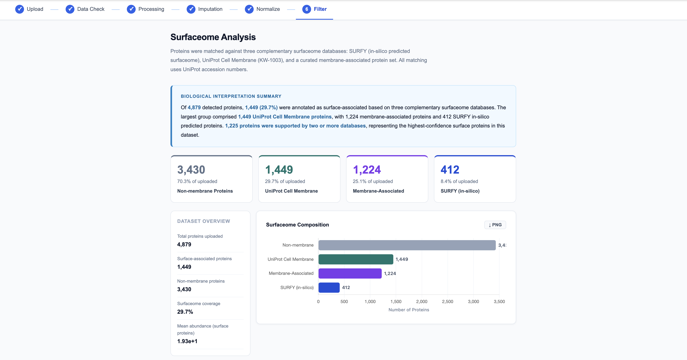

# surfaceome_explorer
An interactive web tool designed to streamline cell-surface protein identification from quantitative proteomics datasets.

## landing page

## surfaceome analysis

#### features:
- data quality control
- missing value estimation
- normalization
- surfaceome filtering
- interactive visualizations
- exportable analysis reports

##### disclaimer: surfaceome explorer is intended for exploratory analysis of quantitative proteomics datasets. protein annotations are based on curated public databases and should be interpreted alongside experimental evidence.
